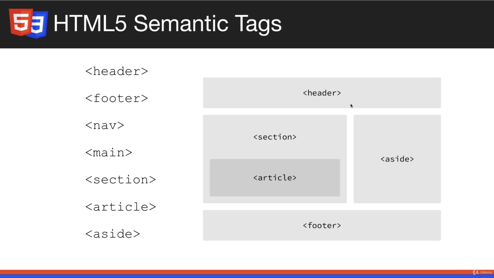

# HTML BASICS

## SECTION INTRO:

### Content:

- What is HTML
- Tags and Attributes
- Page Structure
- Meta Tags
- VS Code live server setup
- Keyboard Shortcuts
- Forms and Input
- Links and Images
- Tables and Lists
- Block vs Inline
- Div, Span, ID, Class
- HTML Entities
- HTML5 Semantic Tags

## Create and Open HTML pages:

### HTML tag:

- Elements surrounded in angle brackets
- Usually have a start and end tag
- Some tags close themselves (Remnant of XHTML)

#### Start and End Tag:

```html
<h1>hello</h1>
<p>Welcome to the world</p>
```

#### Self Closing Tag

```html
<br />
Valid in HTML 5 <br />
Valid in HTML5 and XHTML
```

## Doctype and Basic Layout:

- Browser can read XHTML, HTML5, HTML4.0, HTML4.1 so we specify document type.
  `<!DOCTYPE html>`
- Doc type ref : [link](https://www.w3schools.com/tags/tag_doctype.asp)
- html tags, head tags, body tag
- Head : meta tags, page's info, title tag
- Body : content, script tag
- ctrl + u in browser shows HTML source code.

## Setting UP Live Server(VS Code extension):

- autoreloads browser when saved
- install extension
- right click -> open with live server
- bottom of vscode -> go live / stop port 5500

## Meta Tags & Search Engines:

- Meta tags are tags/snippets to describe page's content
- Tags have attributes, charset is an attribute of meta tag.

```html
<meta charset="UTF-8" />
<meta name="viewport" content="width=device-width, initial-scale=1.0" />
<meta http-equiv="X-UA-Compatible" content="ie=edge" />
```

- UTF-8 is default; character encoding for unicode.
- viewport is important for responsive designs(to make sites look good for different screen sizes)
- content's width is also set to the width of the device
- scale = 1.0
- ie=edge for internet explorer to follow edge's standards

### Search Engines:

- Title : Something that describes the page, Use suitable keywords to boost your search rank
- Title is what shows in searches in Large Blue Text
- meta description is what shows below the title in search pages.

```html
<meta name="description" content="This is my website description" />
```

- Keywords metatag, not as important as before.

```html
<meta name="keywords" content="web development, web design" />
```

- If you want to hide from Search Engine use the robots metatag.

```html
<meta name="robots" content="NOINDEX, NOFOLLOW" />
```

## Headings, Paragraphs, Typography:

- **LPT:** if you are in the middle of line and press `ctrl + enter` you go to new line.
- You can change font size of heading with CSS
- **LPT:** Usually use one **h1** per page, since search engine look for them. You may have other headings as many as you want.
- lorem10, lorem500, lorem tags with emmet is possible to generate dummy texts
- **LPT:** ALT + z to wrap text in VS Code
- `<b></b>, ,<i></i>, <u></u>` tags have been deprecated because html is not meant for styling
- Strong and Emphasis are semantic tags and we can specify from CSS what they mean, and how they can stand out.
- <del> architecto</del> `<del>` tag for strikethrough but it can be customized from CSS, it is not like `<s></s>` tag which absolutely meant strikethrough

## Links, Images and Attributes:

- **LPT:** CTRL + left/ right arrow move cursor word-wise
- Opening link in new windows: use `target = "_blank"`

```html
<a href="http://google.com">Click for Google</a>
<a href="http://google.com" target="_blank">Click for Google in New Window</a>
```

- Here the two a tag appear in the same line in browser. Reason :**a** tag is **inline** element whereas **p** is **block** element.
- **LPT:** ALT + up/down arrow moves the line
- Internal Links:

```html
<a href="04_typography.html">Typography</a>
```

- Images

```html
<!-- Local Image -->


<!-- Remote Image -->

```

## Lists and Tables:

#### Unordered List

- Not Numbered
- They have Bullet Point which you can customize with CSS. Used with navigation menus (horizontal navigate nav bar, side menu , ...)

```html
<ul>
  <li>Item 1</li>
  <li>Item 2</li>
  <li>Item 3</li>
  <li>Item 4</li>
</ul>
```

- Emmet TIP -> `li*4` enter creates 4 <li> rows

#### Ordered List

```html
<!-- Ordered List -->
<ol type="I">
  <li>Item 1</li>
  <li>Item 2</li>
  <li>Item 3</li>
  <li>Item 4</li>
</ol>
```

#### Nested List:

- Identation is added and bullet type is changed

```html
<!-- Unordered List -->
<ul style="list-style: square;">
  <li>Item 1</li>
  <li>
    Item 2
    <ul>
      <li>item 2.1</li>
      <li>item 2.2</li>
      <li>item 2.3</li>
    </ul>
  </li>
  <li>Item 3</li>
  <li>Item 4</li>
</ul>
```

#### Tables:

- Used for tabular data
- Back in the days tables were used for website layout. They kept sidebars and menu in table. But now we have grid and flex.
- Has head `<thead>`, row`<tr>`, heading`<th>`, body`<tbody>` - contains data, data`<td>` contains element in the row`<tr>`
- Use the `<table>` tag
- Table can also have footer

```html
<table>
  <thead>
    <tr>
      <th>First Name</th>
      <th>Last Name</th>
      <th>Email</th>
    </tr>
  </thead>
  <tbody>
    <tr>
      <td>John</td>
      <td>Doe</td>
      <td>John@gmail.com</td>
    </tr>
    <tr>
      <td>kate</td>
      <td>smith</td>
      <td>smith@gmail.com</td>
    </tr>
    <tr>
      <td>Jeff</td>
      <td>Wilson</td>
      <td>Wilson@gmail.com</td>
    </tr>
  </tbody>
</table>
```

## Forms and Input Field:

### Forms:

- Forms are processed in the backend; however, there might be some services whose snippets we can use.
- form's action is where the form is submitted to
- divs are division used to separate markups in certain ways

```html
<form action="process.php">
  <div>
    <label for="name">Name</label>
    <input type="text" id="name" name="name" />
  </div>
</form>
```

- `for` attribute of `label` should match `id` of `input` type so that when we click on the `label` the `input` field gets highlighted.
- the `input` field has `name` attribute which is useful on the server side where we want to access the value of that field in when the form is submitted.

### Forms Input Optons:

- Notice the different in input type's value

#### text input

- Pre-set value to "John Doe" using value attribute

```html
<div>
  <label for="name">Name</label> <br />
  <input type="text" id="name" name="name" value="John Doe" />
</div>
```

#### Email Input

- Email validation provided. Input has to be an email.
- Use placeholder attribute to display light instructive text in the email text field

```html
<div>
  <label for="email">Email:</label> <br />
  <input type="email" name="email" id="email" placeholder="Enter an email" />
</div>
```

#### Message Input

- We can use the `<textarea></textarea>` tag
- We can specify the width and length of textarea by using cols and rows attribute

```html
<div>
  <label for="message">Message:</label> <br />
  <textarea name="message" id="message" cols="50" rows="5"></textarea>
</div>
```

#### Select List

- When selected, the value we have defined in `<option></option>` tag is submitted.
- We have `<select></select>` tag
- We put option's label between `<option></option>` tag and it's value is assigned to the value attribute.
- Use `selected` attribute to preselect an option

```html
<div>
  <label for="sex">Sex</label>
  <select name="sex" id="sex">
    <option value="male">male</option>
    <option value="female" selected>female </option>
    <option value="other">other</option>
  </select>
</div>
```

#### Number Input

- Number field bans writing letters and symbols except the letter **e** which could mean exponent.

```html
<div>
  <label for="age">Age:</label> <br />
  <input type="number" name="age" id="age" />
</div>
```

#### Date Input

- A Calendar appears where we can select the date and time

```html
<div>
  <label for="birthdate">Birth Date:</label> <br />
  <input type="date" name="birthdate" id="birthdate" />
</div>
```

#### Radio Button

- We label each radio button by adding the text at the end of the radio input element
- We can pre-set a radio button with a `checked` attribute.
- **Input** type of radio for each options and the **name** attribute is same for each of them but the value attribute is going to be different

```html
<div>
  <label for="membership">Membership</label>
  <input type="radio" name="membership" value="simple" id="membership" />Simple
  <input
    type="radio"
    name="membership"
    value="standard"
    id="membership"
    checked
  />
  Standard
  <input type="radio" name="membership" value="super" id="membership" /> Super
</div>
```

#### Checkboxes

- input type => `checkbox`
- Multiple selection is possible, else similar to radio button

```html
<div>
  <label for="likes">I Like..</label>
  <input type="checkbox" name="likes" value="bike" id="likes" />Bike
  <input type="checkbox" name="likes" value="car" id="likes" /> Car
  <input type="checkbox" name="likes" value="boat" id="likes" /> Boat
</div>
```

- **LPT**: highlight a word and press ctrl + d subsequentially to select next occurence of that word, then you can start editing them at once.

#### Submit

- Two options:

```html
<!-- Input Type -->
<input type="submit" value="submit" />
<!-- Using Button -->
<button type="submit">Submit</button>
```

## Block & Inline Level Elements:

reference: https://www.w3schools.com/html/html_blocks.asp

### A block-level element:

- Always starts on a new line
- takes up the full width available (stretches out to the left and right as far as it can).
- The `<div>` element is a block-level element.
- eg `<h1> - <h6> , <header>, <hr>, <li>, <p>, <ol>, <ul>, <form>, <table>`

### Inline Elements:

- An inline element does not start on a new line and it only takes that it requires.
- EG: `<a>, <label>, <script>, <select>, <strong>, <textarea>, <button>, `

### Demo code:

```html
<p style="border:2px green solid">
  Lorem ipsum dolor sit amet consectetur adipisicing elit. Molestiae iusto,
  laboriosam nobis soluta nulla nostrum? Accusamus voluptatibus praesentium
  quas! Laborum quia fugit possimus veritatis voluptatum quae quisquam rem
  laboriosam enim.
</p>
<p style="border:2px green solid">
  Lorem ipsum dolor sit amet, consectetur adipisicing elit. Cupiditate repellat
  quo aliquid modi perferendis. Fuga, odio nihil sint rem qui cumque dolores
  nemo fugiat, quia dolore sit culpa. Optio, repellendus!
</p>

<a style="border:2px red solid" href="#">A link</a>
<a style="border:2px red solid" href="#">A link</a>
```

- The border shows how much of the screen width paragrah(green) and anchor(red border) element occupy respectively.

- **inline block (TBRL)**

## Divs and Spans, Classes and IDs:

- TIP: #test-id enter will create div with id="test-id"
- IDs are given for unique items, eg: main header
- Class can be repeated :Eg scenario -> Same styling for about and contact area
- div is block level element while span is inline
- span is used when you need to apply styles inline.

```html
<p>
  Lorem ipsum dolor sit amet consectetur adipisicing elit.
  <span class="enhance">
    A facere consequatur ut harum, porro hic sit perferendis, debitis doloremque
    quia, commodi tempore.
  </span>
  Esse odio nostrum officiis hic tempora mollitia vitae incidunt, sapiente ea
  repellat, consequuntur totam numquam tempore excepturi aut?
</p>
```

- Here if we used div, text will be enhanced but there will be line break

### HTML5 Semantic Tags:

- Purpose: To better layout our sections

#### header tags:

- instead of using "main-header" id like `<div id = "main-header" class="card">` we can use the `<header></header>` tag

#### other tags:

- `<nav></nav>` tag, `<section></section>` tag and so on.

#### copyright symbol : `&copy;` op: &copy;

## Entities and Symbols:

### Non Breaking Space:

```html
<!-- these two line have same output -->
<p>Hello, my name is Brad</p>
<p>Hello, my name is Brad</p>
```

- use `&nbsp;` for such space

```html
<p>Hello, my name is &nbsp; &nbsp; &nbsp; &nbsp; Brad</p>
```

- output:
  <p>Hello, my name is &nbsp; &nbsp; &nbsp; &nbsp; Brad</p>

### Angle Brackets:

- using them besides in the html tags
- use gt lt or 60 and 62

```html
<p>5 &gt; 2</p>
<p>5 &#62; 2</p>
<p>1 &lt; 2</p>
<p>1 &#60; 2</p>
```

- Output:
  <p>5 &gt; 2</p>
  <p>5 &#62; 2</p>
  <p>1 &lt; 2</p>
  <p>1 &#60; 2</p>

### Copyright:

```html
<p>&copy;</p>
<p>&reg;</p>
```

### Others:

```html
<!-- Currency -->
<p>&cent;</p>
<p>&pound;</p>
<p>&yen;</p>
<p>&euro;</p>

<!-- Suits -->
<p>&spades;</p>
<p>&clubs;</p>
<p>&hearts;</p>
<p>&diams;</p>

<!-- Computer Code Snippets -->
<code>
  &lt;?php echo 'Hello' &gt;
</code>

<!-- Ctrl + s is in computer font due to kbd -->
<p>Save the file by pressing <kbd>Ctrl + s</kbd></p>
```

## HTML5 Semantic Tags and Challenge:

- `<header>, <footer>, <nav>, <main> , <section>, <article>, <aside>`
- Not just for organization of code
- Helps People with disabilities (by seeing, listening means) to recognize, access and understand component of the page.
  

- Header(`<header>`) goes to the top, with navigation, logo, search bar and so on.
- Footer goes at the bottom
- Nav tag used for navigation menu
- Main could be wrapped around main content , usually people use section
- Section (`<section>`) can wrap specific section such as about, contact section
- Article (`<article>)` is used for post
- aside (`<aside>`) for sidebar content such as ads
- They have just a div elements with different name.
- EG:

```html
<body>
  <!-- Header -->
  <header id="header" class="card">
    <h1>My Website</h1>
    <p>Just Another Website</p>
  </header>

  <!-- Main Content (left) -->
  <main id="main">
    <!-- Welcome Section -->
    <section id="welcome" class="card">
      <h2>Welcome To Our Website</h2>
      <p>
        Lorem ipsum dolor sit amet consectetur adipisicing elit. Fugiat
        cupiditate itaque possimus numquam corporis odit deserunt voluptas
        repellat ad ex earum magnam mollitia magni eaque nisi, excepturi nam
        temporibus! Sed. <br />
        <a href="#" class="text-center">Click For More</a>
      </p>
    </section>
    <!-- Blog Section -->
    <section id="blog">
      <h2>From Our Blog</h2>
      <!-- Article One -->
      <article class="article">
        <h3>Article One</h3>
        <p>
          Lorem ipsum dolor sit amet consectetur adipisicing elit. Autem veniam
          adipisci necessitatibus quia quisquam? Eligendi vitae quia totam
          accusantium officiis!
        </p>
      </article>
      <!-- Article Two -->
      <article class="article">
        <h3>Article Two</h3>
        <p>
          Lorem ipsum dolor sit amet consectetur adipisicing elit. Autem veniam
          adipisci necessitatibus quia quisquam? Eligendi vitae quia totam
          accusantium officiis!
        </p>
      </article>
    </section>
  </main>

  <!-- Sidebar (right) -->
  <aside id="sidebar" class="card">
    <h3>Navigation</h3>
    <!-- Navigation -->
    <nav>
      <ul id="main-nav">
        <li><a href="index.html">Home</a></li>
        <li><a href="about.html">About</a></li>
        <li><a href="contact.html">Contact</a></li>
      </ul>
    </nav>
    <hr />
    <h3>Contact Us</h3>
    <ul>
      <li><strong>Address:</strong> 50 Main st, Boston MA</li>
      <li><strong>Phone:</strong> (555) 555-5555</li>
      <li><strong>Email:</strong> me@somethingcool.come</li>
    </ul>
  </aside>

  <div class="clr"></div>

  <!-- Footer -->
  <footer id="footer">
    <p class="text-center">Copyright &copy; My Website 2019</p>
  </footer>
</body>
```
