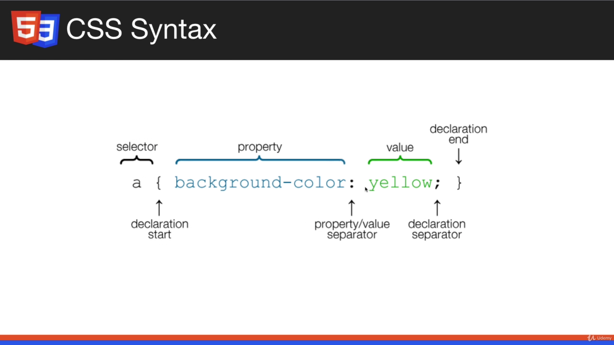
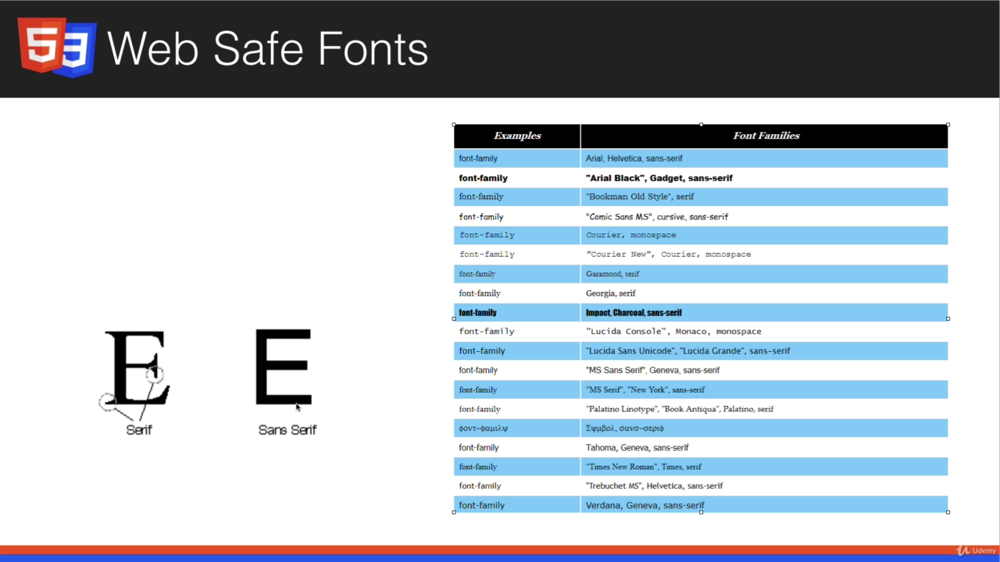
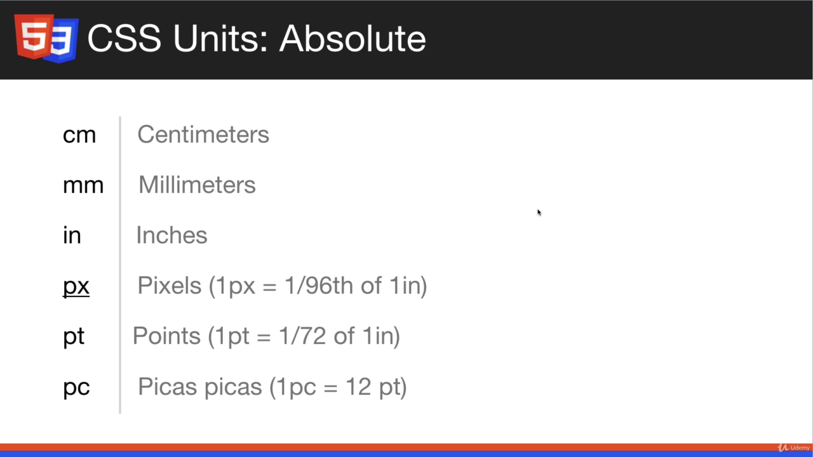
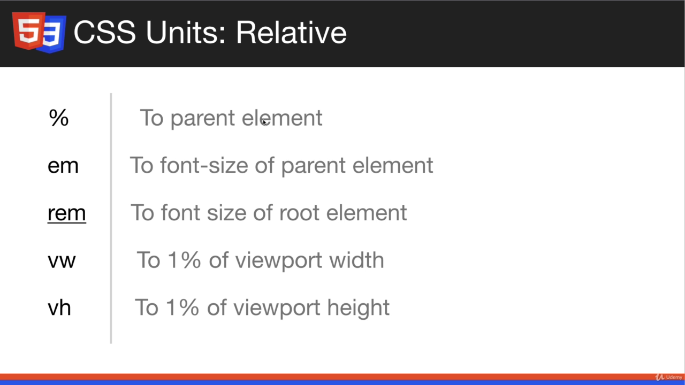

# CSS Basics

## Content:
- CSS Fundamental properties
- Implementing CSS
- Using Selectors
- Fonts, Colors, etc
- Background and borders
- Box Model / Margin and Padding
- Floating and ALignment
- Display Property
- Link and Button Styling
- Creating Menus
- Positioning
- Form Styling
- Dev Tools

## Implementing CSS:
### Inline CSS:
```html
  <!-- Inline CSS -->
  <h1 style="color:red">Heading One</h1>
```
Output:
  <h1 style="color:red">Heading One</h1>

- Avoid the inline CSS. Keep styling out of the markup. (Separation of Concerns)
- Its harder to read and change

### Internal CSS:
- CSS present in same page but within style tag in the head section of html
```html
<head>
  <style>
    h2{
      color: green;
    }
  </style>
</head>
```
### CSS Syntax:


- **Selector**: Can be ids, class or tag
- { declaration start and end }
- property value pair separated by colon 
- semicolon ends a property value pair and there can be more than one pair
- Comment : /* */

### External CSS:
- Use link tag in the header to include external css files:
```html
<link rel="stylesheet" href="css/style.css">
```
- rel -> describes what type of link it is, (its stylesheet in the case of CSS)
- href -> points to the location of the file
- It is the preferred style of styling CSS

## Basic CSS Selection:

- ID: Here h2 element with id(# specifies id) green-heading will get the style.
```css
    h2#green-heading{
      color: green;
    }
```
- using h2 before # is optional. Just using # will allow you to style other element with the green-heading id. 
- id's are unique. If you want multiple tags to have same styling use class.
- using class
```css
    .green-heading{
      color: green;
    }
```

- . is for classes, # is for IDS

- In HTML:
```html
<!-- for id -->
<h2 id="green-heading">Welcome</h2>
<!-- for class -->
<h2 class="green-heading">Welcome</h2> 
```

### Naming Conventions:
- Dont name classes by their properties such as gree-heading. Later if you want to change it, there will be confusion.
- Name it with something such as primary-heading, secondary-heading and so on. 
- Name should fit with change.

### Different sorts of selectors:
```html
  <style>

    /* body(element) styling */
    body{
      background-color: #333;
    }

    /* . is for classes */
    .primary-heading{
      color: green;
    }

    /* # is for ids */
    #welcome{
      background-color: #f4f4f4;
    }
    
    /* multiple selectors using comma */
    #welcome, #about{
      border: 1px solid;
      padding: 10px;
      margin-bottom: 5px;
    }

    /* Nested Selectors (p tag inside welcome id element)*/
    #welcome p{
      font-size: 20px;
    }

    #about{
      color: white;
    }
  </style>
```

## Fonts in CSS:

- there are Family, Size
- Fonts Style : Web Safe Fonts, Google Fonts
- font-Family is usually added in the body, so that it effects your whole page:
```html
  <style>
   body{
    font-family: Arial, Helvetica, sans-serif;
   }
  </style>
```

- In fonts are not Web Safe you must include the font file within website. Web Safe fonts are available in all browsers.

- serif has edges sans serif has no edge
- Font stacks imply that when one is not found the other one is used. 

### Using Google Fonts:
```html
<head>
  <style>
   body{
    font-family: 'Roboto', sans-serif;
    font-size: 18px;
    line-height: 1.6em;
   }
  </style>
  <link href="https://fonts.googleapis.com/css2?family=Roboto&display=swap" rel="stylesheet">
</head>
```
- link and font family are provided at fonts.google.com
- we can also define font-size and line height(spacing between each line)

### CSS units:
- Not just for font size, can be used for margins, paddings, height(line, width) and so on.
#### Absolute Units:

- We mainly use px - pizels
- pt- points, ms word uses pt

#### Relative Units:


- em for times the parent element's size
- rem is em just for root element

### Using Span inside a paragraph to style certain portion of paragraph

```html
<head>
  <style>
    #welcome p span {
      font-weight : bold;
    }
    #about p span {
      font-style : italic;
    }
  </style>
</head>

<body>
  <div id="welcome">
    <h2 class="primary-heading">Welcome</h2>
    <p>Lorem ipsum dolor sit amet consectetur adipisicing elit. Excepturi odio <span>inventore ullam quibusdam dolorem totam possimus </span>laboriosam laborum dignissimos recusandae?</p>
  </div>
  <div id="about">
    <h2>About</h2>
    <p>Lorem ipsum dolor sit amet <span> consectetur adipisicing elit. Sunt, ratione odit</span>  expedita quam totam ex at voluptas neque! Odit, numquam.</p>
  </div>
</body>
```

## Color Types:
- Most common types : Color Name (eg: red, white), RGB (eg: (20,20,15)), Hex (eg : ```#fafafa```)
- Color Name: Get reference from VS Code. 
- RGB Value : Takes three values between 0 to 255. (R, G, B) values. (0,0,0) gives black and (255,255,255) gives white. (255,0,0) is red and so on. Lots of combination.
### **Hex** 
- Most common. 
- A-F, 0-9. 
- 6 or 3 characters. 
- Starts with #. 
- first two red, second two green, last two green. In ```#ffAABB``` ff is for red value, AA is for green value and BB is for blue value.
- **#ff0000** is red,**#00ff00** is green and so on. 
- Having same value leads to shades of grey eg (f4f4f4, ccc, e3e3e3, 333). 
 
```html
<head>
    <style>
   h1{
     /* Color Name */
     color: coral;
   }
   h2{
     /* RGB */
     color: rgb(20,100,120);
   }
   h3{
    /* Hex */
    color: #333;
   }
  </style>
</head>
```
- reference site : https://www.color-hex.com/ , https://htmlcolorcodes.com/

## Backgrounds and Borders:
- for text we use color property but for background color we use the ```background-color``` property
- Here in the following style code each id represents a div. for eg:
```html
 <div id="box-1">
   <h3>Box One</h3>
   <p>Lorem ipsum, dolor sit amet consectetur adipisicing elit. A, quo error? Doloremque harum, asperiores maxime minus voluptatum distinctio tenetur qui quia impedit a magnam quam animi magni! Neque velit, dolorem vel et, praesentium, dicta labore consectetur eveniet perferendis esse beatae.</p>
 </div>
```
- Border has three mandatory properties- width, color and style. We can set them individually or at once as:
```css
      border-width: 3px;
      border-color: red;
      border-style: solid; /*dashed, dotted, ... */
      border : 3px solid red;
```
- We can also just use background to add color or background image.
- With border radius we can add curve to the corner of the border. You dont even need the border to add border radius, just adding it will round the corner of the element
- We can also specify border position such as top, bottom. eg: 
```css
  border-radius: 10px;
  border-top: blue solid 3px;
  border-top-left-radius: 10px; /* only curve the top left corner of the border */
  border-top-right-radius: 10px;
```

```html
<head>
  <style>
    #box-1{
      background-color: blanchedalmond;
      /* border-width: 3px;
      border-color: red;
      border-style: solid; */
      border : 3px solid red;
      border-radius: 10px;
    }
    #box-2{
      background: #333;
      color: #fff;
      border-top: blue solid 3px;
      border-top-left-radius: 10px;
      border-top-right-radius: 10px;
    }
    #box-3{
      /* background-image: url('http://'); */
      /* background-image: url('./img/stars.jpg'); */
      /* background-repeat: no-repeat; */
      /* background-position: 100px 0; */
      /* background-position: -100px -100px; */
      /* background-position: center; */
      /* background-position: center top; */
      /* background-position: 100px 100px; */
      background-size: cover;
      background: url('./img/stars.jpg') no-repeat center center/cover;
      color: #fff;
      height: 200px;
      width: 600px;
    }

    #box-4{
      background: url('./img/leaf.png') no-repeat center center;
      background-attachment: fixed;

    }
  </style>
</head>
```
- background-image with url -> ```background-image: url('./img/stars.jpg');```. It takes the size of the element. You only see the portion of the background image that covers the element's size. 
- However we can also change the size of the element with width and height property. EG: ```height: 200px;``` , ```width: 600px;```
- Background repeat property lets us decide whether the image repeats until it fits in the element's background. It has choices such as to repeat in x-axis or y-axis and so on. ```background-repeat: no-repeat;```
- Background position property: to move the image around. EG: 
```css
  background-position: 100px 0;
  background-position: -100px -100px;
  background-position: center;
  background-position: center top;
  background-position: 100px 100px;
```
- To show whole image without compromise: ```background-size: cover;```
- Just using background property we can specify image, position, no-repeat, cover in a single line
```css
  background: url('./img/stars.jpg') no-repeat center center/cover;
```
- fixed background: picture remains in one position within the element without being effected by scrolling

## Box Model, Margin and Padding:

