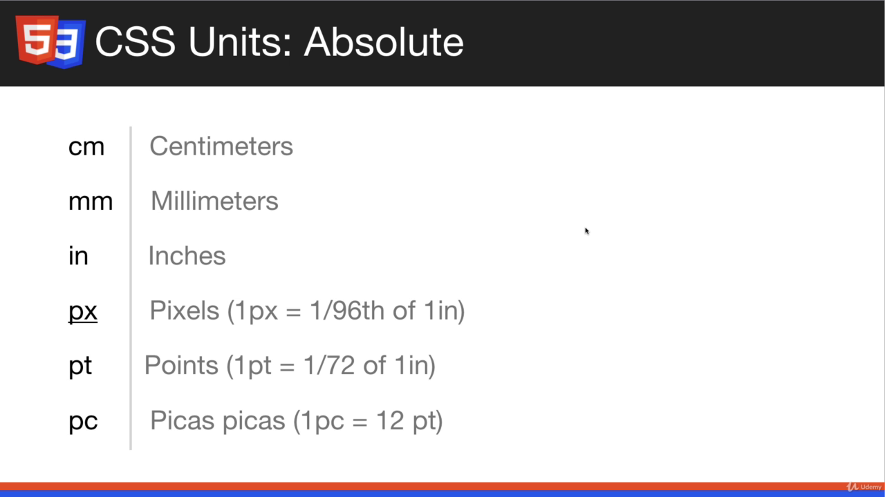

# CSS Basics

## Ref: 
https://www.w3schools.com/cssref/


## Content:
- CSS Fundamental properties
- Implementing CSS
- Using Selectors
- Fonts, Colors, etc
- Background and borders
- Box Model / Margin and Padding
- Floating and Alignment
- Display Property
- Link and Button Styling
- Creating Menus
- Positioning
- Form Styling
- Dev Tools

## Implementing CSS:
### Inline CSS:
```html
  <!-- Inline CSS -->
  <h1 style="color:red">Heading One</h1>
```
Output:
  <h1 style="color:red">Heading One</h1>

- Avoid the inline CSS. Keep styling out of the markup. (Separation of Concerns)
- Its harder to read and change

### Internal CSS:
- CSS present in same page but within style tag in the head section of html
```html
<head>
  <style>
    h2{
      color: green;
    }
  </style>
</head>
```
### CSS Syntax:


- **Selector**: Can be ids, class or tag
- { declaration start and end }
- property value pair separated by colon 
- semicolon ends a property value pair and there can be more than one pair
- Comment : /* */

### External CSS:
- Use link tag in the header to include external css files:
```html
<link rel="stylesheet" href="css/style.css">
```
- rel -> describes what type of link it is, (its stylesheet in the case of CSS)
- href -> points to the location of the file
- It is the preferred style of styling CSS

## Basic CSS Selection:

- ID: Here h2 element with id(# specifies id) green-heading will get the style.
```css
    h2#green-heading{
      color: green;
    }
```
- using h2 before # is optional. Just using # will allow you to style other element with the green-heading id. 
- ids are unique. If you want multiple tags to have same styling use class.
- using class
```css
    .green-heading{
      color: green;
    }
```

- . is for classes, # is for IDS

- In HTML:
```html
<!-- for id -->
<h2 id="green-heading">Welcome</h2>
<!-- for class -->
<h2 class="green-heading">Welcome</h2> 
```

### Naming Conventions:
- Dont name classes by their properties such as green-heading. Later if you want to change it, there will be confusion.
- Name it with something such as primary-heading, secondary-heading and so on. 
- Name should fit with change.

### Different sorts of selectors:
```html
  <style>

    /* body(element) styling */
    body{
      background-color: #333;
    }

    /* . is for classes */
    .primary-heading{
      color: green;
    }

    /* # is for ids */
    #welcome{
      background-color: #f4f4f4;
    }
    
    /* multiple selectors using comma */
    #welcome, #about{
      border: 1px solid;
      padding: 10px;
      margin-bottom: 5px;
    }

    /* Nested Selectors (p tag inside welcome id element)*/
    #welcome p{
      font-size: 20px;
    }

    #about{
      color: white;
    }
  </style>
```

## Fonts in CSS:

- there are Family, Size
- Fonts Style : Web Safe Fonts, Google Fonts
- font-family is usually added in the body, so that it effects your whole page:
```html
  <style>
   body{
    font-family: Arial, Helvetica, sans-serif;
   }
  </style>
```

- If fonts are not Web Safe you must include the font file within website. Web Safe fonts are available in all browsers.

- serif has pointy edges sans serif has no pointy edge
- Font stacks imply that when one is not found the other one is used. 

### Using Google Fonts:
```html
<head>
  <style>
   body{
    font-family: 'Roboto', sans-serif;
    font-size: 18px;
    line-height: 1.6em;
   }
  </style>
  <link href="https://fonts.googleapis.com/css2?family=Roboto&display=swap" rel="stylesheet">
</head>
```
- link and font family are provided at fonts.google.com
- we can also define font-size and line height(spacing between each line)

### CSS units:
- Not just for font size, can be used for margins, paddings, height(line, width) and so on.
#### Absolute Units:

- We mainly use px - pizels
- pt- points, ms word uses pt

#### Relative Units:


- em for times the parent element's size
- rem is em just for root element

### Using Span inside a paragraph to style certain portion of paragraph

```html
<head>
  <style>
    #welcome p span {
      font-weight : bold;
    }
    #about p span {
      font-style : italic;
    }
  </style>
</head>

<body>
  <div id="welcome">
    <h2 class="primary-heading">Welcome</h2>
    <p>Lorem ipsum dolor sit amet consectetur adipisicing elit. Excepturi odio <span>inventore ullam quibusdam dolorem totam possimus </span>laboriosam laborum dignissimos recusandae?</p>
  </div>
  <div id="about">
    <h2>About</h2>
    <p>Lorem ipsum dolor sit amet <span> consectetur adipisicing elit. Sunt, ratione odit</span>  expedita quam totam ex at voluptas neque! Odit, numquam.</p>
  </div>
</body>
```

## Color Types:
- Most common types : Color Name (eg: red, white), RGB (eg: (20,20,15)), Hex (eg : ```#fafafa```)
- Color Name: Get reference from VS Code. 
- RGB Value : Takes three values between 0 to 255. (R, G, B) values. (0,0,0) gives black and (255,255,255) gives white. (255,0,0) is red and so on. Lots of combination.
### **Hex** 
- Most common. 
- A-F, 0-9. 
- 6 or 3 characters. 
- Starts with #. 
- first two red, second two green, last two green. In ```#ffAABB``` ff is for red value, AA is for green value and BB is for blue value.
- **#ff0000** is red,**#00ff00** is green and so on. 
- Having same value leads to shades of grey eg (f4f4f4, ccc, e3e3e3, 333). 
 
```html
<head>
    <style>
   h1{
     /* Color Name */
     color: coral;
   }
   h2{
     /* RGB */
     color: rgb(20,100,120);
   }
   h3{
    /* Hex */
    color: #333;
   }
  </style>
</head>
```
- reference site : https://www.color-hex.com/ , https://htmlcolorcodes.com/

## Backgrounds and Borders:
- for text we use color property but for background color we use the ```background-color``` property
- Here in the following style code each id represents a div. for eg:
```html
 <div id="box-1">
   <h3>Box One</h3>
   <p>Lorem ipsum, dolor sit amet consectetur adipisicing elit. A, quo error? Doloremque harum, asperiores maxime minus voluptatum distinctio tenetur qui quia impedit a magnam quam animi magni! Neque velit, dolorem vel et, praesentium, dicta labore consectetur eveniet perferendis esse beatae.</p>
 </div>
```
- Border has three mandatory properties- width, color and style. We can set them individually or at once as:
```css
      border-width: 3px;
      border-color: red;
      border-style: solid; /*dashed, dotted, ... */
      border : 3px solid red;
```
- While setting them all at once, the order doesnot matter, it could be ```3px, solid, red``` or ```red, 3px, solid```
- We can also just use background to add color or background image.
- We can also specify border position such as top, bottom. eg: 
```css
  border-radius: 10px;
  border-top: blue solid 3px;
  border-top-left-radius: 10px; /* only curve the top left corner of the border */
  border-top-right-radius: 10px;
```
- With border radius we can add curve to the corner of the border. You dont even need the border to add border radius, just adding it will round the corner of the element

### THE Example CODE:

```html
<head>
  <style>
    #box-1{
      background-color: blanchedalmond;
      /* border-width: 3px;
      border-color: red;
      border-style: solid; */
      border : 3px solid red;
      border-radius: 10px;
    }
    #box-2{
      background: #333;
      color: #fff;
      border-top: blue solid 3px;
      border-top-left-radius: 10px;
      border-top-right-radius: 10px;
    }
    #box-3{
      /* background-image: url('http://'); */
      /* background-image: url('./img/stars.jpg'); */
      /* background-repeat: no-repeat; */
      /* background-position: 100px 0; */
      /* background-position: -100px -100px; */
      /* background-position: center; */
      /* background-position: center top; */
      /* background-position: 100px 100px; */
      background-size: cover;
      background: url('./img/stars.jpg') no-repeat center center/cover;
      color: #fff;
      height: 200px;
      width: 600px;
    }

    #box-4{
      background: url('./img/leaf.png') no-repeat center center;
      background-attachment: fixed;

    }
  </style>
</head>
```
- **background-image** with url -> ```background-image: url('./img/stars.jpg');```. It takes the size of the element. You only see the portion of the background image that covers the element's size. 
- However we can also change the size of the element with width and height property. EG: ```height: 200px;``` , ```width: 600px;```
- Background repeat property lets us decide whether the image repeats until it fits in the element's background. It has choices such as to repeat in x-axis or y-axis and so on. ```background-repeat: no-repeat;```
- Background position property: to move the image around. EG: 
```css
  background-position: 100px 0;
  background-position: -100px -100px;
  background-position: center;
  background-position: center top;
  background-position: 100px 100px;
```
- To show whole image without compromise: ```background-size: cover;```
- Just using **background** property we can specify image, position, no-repeat, cover in a single line
```css
  background: url('./img/stars.jpg') no-repeat center center/cover;
```
- **fixed background**: picture remains in one position within the element without being effected by scrolling

## Box Model, Margin and Padding:

- div element's default CSS (observed from the chrome's developers tool)
```css
div {
    display: block;
}
```
- block means that it goes all the way across the window's width.
### Box model :

  

#### Four layers : 
1. Element: 
    - height and width can be adjusted.
    - Default width - whole page, default height - according to content present
2. Padding : Spacing between border and element
3. Border : As we saw before
4. Margin : Space outside border

#### Default Values:
```css
display:block;
font-size:18.72px;
font-weight:700;
/* height:22px; */
margin-block-end:18.72px;
margin-block-start:18.72px;
margin-inline-end:0px;
margin-inline-start:0px;
/* width:831px; */
```

#### Removing Margin
```css
.box p {
  margin:0;
}
```

#### Taking away default styling with Reset:
- Number of ways to do this. 
- Followig is the easiest way:
```css
  /* CSS Reset */
  *{
    /* Top bottom left and right
    ** Margin and Padding is zero  */
    margin : 0;
    padding : 0;
  }
```
- *{} selects all the elements

### Some Properties for Margin and Padding:
#### box-sizing:
```css
*{
  margin : 0;
  padding : 0;
  box-sizing: border-box;
}
.box{
  background: #f4f4f4;
  border: 2px #777 solid;
  width: 500px;

  /* padding on all sides */
  padding : 120px;
}
```
- Box is 500px and within the box there is 120px padding. If we didnot set box-sizing to border-box, 120px space would be added the width of the element as 500 + 120 px.  

### Padding and Margin Styles:
- Bottom property has higher precedence so they can override above properties:
```css
  .box{
    background: #f4f4f4;
    border: 2px #777 solid;
    width: 500px;

    /* padding on all sides */
    padding : 20px;

    /* Padding per side */
    padding-top: 10px;
    padding-right: 20px;
    padding-bottom: 10px;
    padding-left: 20px;

    /* Shorthand Padding order matters
    top, right, bottom, left */
    padding : 10px 20px 10px 20px;

    /* Padding SHorthand = top/bottom left/right */
    padding: 10px 20px;
    
    /* margin on all sides */
    margin: 20px;

    /* Margin per side */
    margin-top: 10px;
    margin-right: 20px;
    margin-bottom: 10px;
    margin-left: 20px;

    /* Shorthand Margin order matters
    top, right, bottom, left */
    margin : 10px 20px 10px 20px;

    /* Margin SHorthand = top/bottom left/right */
    margin: 10px 20px;

  }
```
- here padding-top, -right, -bottom, and -left will override the padding property because they appear further down. Same for margins

## FLOAT and ALIGNMENT:

### Content:
- Aligning Text
- Auto Margin

### Centering:
- Use the Container Element. 
- Add width to container and set the margin to auto. 
- Auto margin apply same margins to both sides, pushing it to the middle.
```html
  <style>
    .container{
      /* width:960px; */

      /* Makes the content more responsive for smaller windows and devices */
      max-width:960px;

      /* 30px top-bottom, auto left-right */
      margin: 30px auto; 
    }
    
  </style>
  <body>

  <div class="container">
    <div id="box-1" class="box">
      <h3>Heading 1</h3>
  ...
```
#### max-width:
- The max-width property defines the maximum width of an element. 
If the content is larger than the maximum width, it will automatically change the height of the element. 
- If the content is smaller than the maximum width, the max-width property has no effect. 
- Note: This prevents the value of the width property from becoming larger than max-width. 
- The value of the max-width property overrides the width property.

### Text Align
```css
  .box p{
    /* text align */
    text-align : justify;
  }
```
### Floats:
- Not going to be used much
- Just for the substitute of Flex and Grid.
- Once you know flex and grid abandon float
- Useful for Creating sidebars and grid views
```css
  #box-2{
    float: left;
    width: 53%; /* percentage of container's width */
  }
  #box-3{
    float: right;
    width:45%;
  }
  .clr{
    clear:both; /* to clear left and right floats */
  }
```
- Just dont forget to clear floats:
```html
 <div class="clr"></div>
```
- Use clear right after divs of floating class

### Link State and Button Styling:
- Links have different state: regular, hover, active, visited.
- You can style these link states using the pseudo selector.
```css
  a{
    color : #333;
    text-decoration: none;
  }

  a:hover{
    color: coral;
    text-decoration:underline;
    /* font-size: 40px; */
  }
  a:visited{
    color:red;
  }

  a:active{
    color: green;
  }
```
- Here ```a:<state>``` is a pseudo selector 

#### Button Styling:
```css
  .btn{
    background: #4c6ca0;
    color: #fff;
    border: none;
    font-size: 16px;
    padding: 10px 20px;
    border-radius: 5px;
    cursor: pointer;
  }

  .btn:hover{
    color: #f4f4f4;
    background: #446190;
  }
```

### Navigation Menu Styling:
- By default unordered list has 40px padding on the left side
- Side Menu Styling:
```css
.side-menu{
  list-style: none; /* remove bullets */
  border: 1px #ddd solid;
  border-radius: 10px;
  width: 300px;
  padding: 20px;
}
.side-menu li{
  font-size: 18px;
  line-height: 2.4em;
  border-bottom: dotted 1px #ddd;
}
.side-menu li:last-child{
  border:none; /* Pseudo selector to select last list item */
}

.side-menu li a {
  color: #333;
  text-decoration: none; /* to remove underline from link item */
}

.side-menu li a:hover{
  color: coral; 
}
```
- Side Menu HTML:
```html
 <ul class="side-menu">
   <li><a href="#">Home</a></li>
   <li><a href="#">About</a></li>
   <li><a href="#">Services</a></li>
   <li><a href="#">Contact</a></li>
 </ul>
```

#### Navbars:
- CSS:
```css
  .navbar{
    list-style: none;
    margin: 0;
    padding : 0;
    background: #4c6ca0;
    border-radius: 5px;
    overflow: auto; /* So that float dont knock out bg color */
  }
  .navbar li {
    /* Padding here is not good idea
    since hovering will cover whole item at once*/
    float: left;
  }
  .navbar li a{
    display: block; /*display as block allows us to add spaces and padding (up, down,left and right) */
    color: blanchedalmond;
    text-decoration: none;
    padding: 15px 20px;
  }
  .navbar li a:hover{
    background-color: #446190;
    color: #f4f4f4;
  }
```
- HTML:
```html
 <ul class="navbar">
   <li><a href="#">Home</a></li>
   <li><a href="#">About</a></li>
   <li><a href="#">Services</a></li>
   <li><a href="#">Contact</a></li>
 </ul
```

## INLINE, BLOCK and INLINE-BLOCK DISPLAY:

- The DISPLAY property is very important and we use it with flexbox and grid too. 
### Converting block to inline:
```html
  <head>
    <style>
      li {
        display: inline; /* Even the bullet disappears*/
      }
      li a {
        padding-right: 20px; 
      }
    </style>
  </head>
  <body>
    <ul>
      <li><a href="#">Technology</a></li>
      <li><a href="#">Business</a></li>
      <li><a href="#">Fashion</a></li>
    </ul>
  </body>
```
- list is a block level element
- We changed to inline using the ```display : inline``` property

### Converting inline to block:
- Centering image is not possible because it is an inline element ```margin:auto``` wont work
- CSS:
```css
   img{
     display: block;
     margin:auto;
   }
```
- HTML:
```html

```

### Using inline-block:
- div is a block element.
- setting ```display: inline``` wont take width and ```margin-bottom``` property
- So, we use ```display:inline-block ```
- Inline-block goes horizontal but it also allows us to add widths
- HTML:
```html
  <div class="box">
    <h3>Heading</h3>
    <p>Lorem ipsum dolor sit amet consectetur adipisicing elit. Quasi recusandae repellat quo doloremque, ut amet deserunt minima beatae fugit vitae!</p>
  </div>
  <div class="box">
    <h3>Heading</h3>
    <p>Lorem ipsum dolor sit amet consectetur adipisicing elit. Quasi recusandae repellat quo doloremque, ut amet deserunt minima beatae fugit vitae!</p>
  </div>
  <div class="box">
    <h3>Heading</h3>
    <p>Lorem ipsum dolor sit amet consectetur adipisicing elit. Quasi recusandae repellat quo doloremque, ut amet deserunt minima beatae fugit vitae!</p>
  </div>
```
- CSS:
```CSS
   .box{
     width: 32.8%;
     display: inline-block;
     box-sizing: border-box;
     background: #f4f4f4;
     padding: 20px;
     margin-bottom: 15px;
   }
```

## POSITIONING:

- Positioning elements in the page
- 

- We are going to create 5 boxes and position them
- HTML CODE:
```html
<body>
 <div id="box-1" class="box"></div>
 <div class="container">
  <div id="box-2" class="box"></div>
  <div id="box-3" class="box"></div>
 </div>
 <div id="box-4" class="box"></div>
 <div id="box-5" class="box"></div>
</body>
```
- Positioning code in CSS:
```css
    body{
      height: 4000px;
    }
   .box{
     width : 100px;
     height: 100px;
   }

   .container{
     position: relative; /* we can use top right bttom and left now */
     width: 500px;
     height: 500px;
     background: #333;
     /* z-index: 2; */
   }

   #box-1{
     position: relative;
     top: 50px; 
     left: 50px;
     z-index: 1;
     background: red;
   }

   #box-2{
     position: absolute; /* with respect to container, i.e its parent */
     top: 100px; /* move up a 100px */
     left: 100px; /* move left a 100px */
     background: yellow;
   }
   #box-3{
    position: absolute;
    bottom: 100px;
    right: 100px;
    background: green;
   }
   #box-4{
      position: fixed; 
      bottom: 0;
      right: 0;
      width: 300px;
      background: blue;
   }
   #box-5{
     position:sticky;
     top:0; /* where we want to stick is top 0*/
     background: orange;
     z-index: -1;
   }
```
- Everything by default has a position of static
- with top, bottom, right and left we can move the element if w.r.t its parent if we have positioned them as absolute.
- z-index : which element (overlapping) will go to front. Higher the z-index, more front it is wrt to other elements. 
- fixed is used to position an element at the desired position irrespective to the scroll

*(note: Fixed is not working)*

## Aside Visibility, Order and Negative Margin

- ```display: none;``` : Useful when building responsive sites where you might want to hide something from mobile devices. It completely removes from the DOM
- ```visibility: hidden;``` is similar to display:none, but it occupies the space. Makes invisible but still present in DOM.

### Precedence:
- Further down => Higher precedence
- Styling with class => Higher precedence than styling elements
#### Important Flag:
- If you want your style to override other style you can use the important flag
- ```color : blue !important;```

### Negative Margin:
```css
  margin-top:-30px; /* pushes up */
  margin-left: -30; /* pushes the element to the left */
```
- doesnot work with padding.