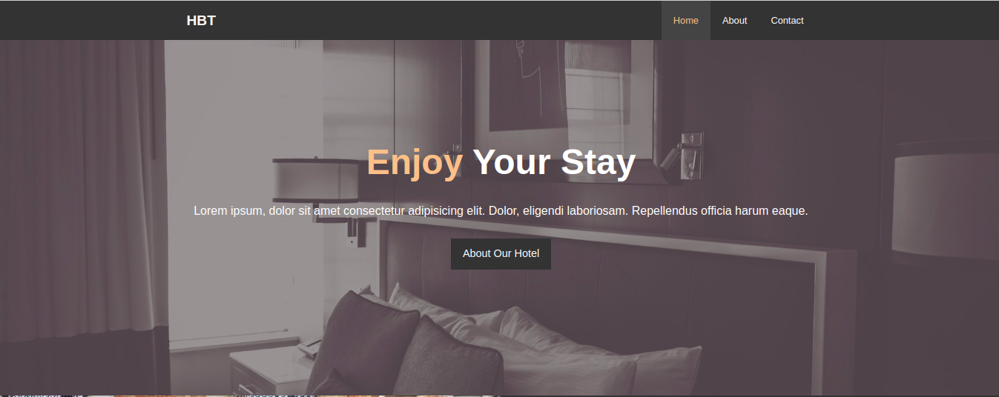

# The Hotel Website:

- Image Source: https://pixels.com/
- Icons : Fontawesome
- NOT YET RESPONSIVE (MEdia Query will be introduced later)

## Design and Ideas:
- Replicate what designer have done in Photoshop or Sketch in html and css.
- Search for themes and sites and get idea from them

## File Structure and Navbar:
### Creating Page Structure:
#### Head/Meta/Title Section:
```html
<head>
  <meta charset="UTF-8">
  <meta name="viewport" content="width=device-width, initial-scale=1.0">
  <meta http-equiv="X-UA-Compatible" content="ie=edge">
  <meta name="description" content="Welcome to the most extraordinary hotel in Lalitpur">
  <meta name="keywords" content="hotel, kathmandu, lalitpur, satdobato">
  <link rel="stylesheet" href="css/style.css">
  <title>Hotel BT | Welcome</title>
</head>
```

#### Header:
- With navbar, logo and Showcase:


- HTML Code:
```html
  <header>
    <nav id="navbar">
      <div class="container">
        <h1 class="logo"><a href="index.html">HBT</a></h1>
        <ul>
          <li><a class="current" href="index.html">Home</a></li>
          <li><a href="about.html">About</a></li>
          <li><a href="contact.html">Contact</a></li>
        </ul>
      </div>
    </nav>
  </header>
```
- TIPS: use id for elements that surrounds other elements (such as ul, nav, ...). ID for something you wont have duplicates of. 
- CSS CODE:
```css
/* Reset */
*{
  margin: 0;
  padding: 0;
  box-sizing: border-box; /*so padding doesnt add width */
}

/* Main Styling */
html,body{
  font-family: 'Segoe UI', Tahoma, Geneva, Verdana, sans-serif;
  line-height: 1.7em;
}

a{
  color:#333;
  text-decoration: none;
}

h1,h2,h3{
  padding-bottom: 20px;
}

p{
  margin: 10px 0;
}

/* Utility Classes */
.container{
  margin: auto;
  max-width: 1100px;
  overflow: auto;
  padding: 0 20px;
}

/* Navbar */
#navbar{
  background: #333;
  color: #fff;
  overflow: auto; /* so bg shows no matter what */
}

#navbar a{
  color: #fff;
}

#navbar h1{
  float: left;
  padding-top: 20px;
}

#navbar ul {
  list-style: none; /* remove bullets */
  float: right;
}

#navbar ul li {
  float : left
}

#navbar ul li a {
  display: block;
  padding: 20px;
  text-align: center;
}

#navbar ul li a:hover, 
#navbar ul li a.current {
  background: #444;
  color: #f7c08a;
}
```

## Showcase and Home Info:
### Utility Classes : 
- Not specific target element. Can be used for variety of elements
```css
/* Utility Classes */
.container{
  margin: auto;
  max-width: 1100px;
  overflow: auto;
  padding: 0 20px;
}

.text-primary{
  color: #f7c08a;
}

.lead{
  font-size: 20px;
}
```

### Showcase Code:
- HTML:
```html
    <div id="showcase">
      <div class="container">
        <div class="showcase-content">
          <h1><span class="text-primary">Enjoy</span> Your Stay</h1>
          <p class="lead">Lorem ipsum, dolor sit amet consectetur adipisicing elit. Vel, distinctio officia corrupti omnis necessitatibus labore.</p>
          <a class="btn" href="about.html">About Our Hotel</a>
        </div>
      </div>
    </div>
  </header>
```

- CSS:
```css
/* Showcase */
#showcase{
  background: url('../img/showcase.jpg') no-repeat center center/cover;
  height: 600px;
}

#showcase .showcase-content{
  color: #fff;
  text-align: center;
  padding-top: 170px;
}

#showcase .showcase-content h1 {
  font-size: 60px;
  line-height: 1.2em;
}

#showcase .showcase-content p {
  padding-bottom: 20px;
  line-height: 1.7em;
}
```

### Home Info:
- It is wrapped around the section
- HTML CODE:
```html
  <section id="home-info" class="bg-dark">
    <div class="info-img"></div>
    <div class="info-content">
      <h2><span class="text-primary">The History</span> Of Our Hotel</h2>
      <p>
        Lorem ipsum dolor, sit amet consectetur adipisicing elit. Assumenda
        aliquam dolor alias iste autem, quaerat magni unde accusantium qui
        fuga placeat quidem quo pariatur, voluptatum, ea sequi? Corporis,
        explicabo quisquam dolor placeat praesentium nesciunt mollitia quos
        nobis natus voluptatum asperiores!
      </p>
      <a href="about.html" class="btn btn-light">Read More</a>
    </div>
  </section>
```
- CSS Code:
```css
/* UTILITY */
.btn-light{
  background: #f4f4f4;
  color: #333;
}
.bg-dark{
  background: #333;
  color: #fff;
}
.bg-light{
  background: #f4f4f4;
  color: #333;
}
.bg-primary{
  color: #f7c08a;
  background: #333;
}

/* Home Info */
#home-info {
  height: 400px
}

#home-info .info-img{
  float: left;
  width: 50%;
  background: url('../img/photo-1.jpg') no-repeat;
  min-height: 100%;
}

#home-info .info-content{
  float: right;
  width: 50%;
  height: 100%;
  text-align: center;
  padding: 50px 30px;
  overflow: hidden; /* So there is no scroll pane when the content doesnot fit the window */
}
#home-info .info-content p{
  padding-bottom: 30px; /* Space between paragraph and link */
}
```

## Features and Footer
- Add new section
- Add fontawesome icons

### HTML CODE:
```html
  <section class="" id="features">
    <div class="box bg-light">
      <i class="fas fa-hotel fa-3x" ></i>
      <h3>Great Location</h3>
      <p>Lorem ipsum dolor sit amet consectetur adipisicing elit. Officia, aperiam!</p>
    </div>
    <div class="box bg-primary">
      <i class="fas fa-utensils fa-3x" ></i>
      <h3>Free Meals</h3>
      <p>Lorem ipsum dolor sit amet consectetur adipisicing elit. Officia, aperiam!</p>
    </div>
    <div class="box bg-light">
      <i class="fas fa-dumbbell fa-3x" ></i>
      <h3>Fitness Room</h3>
      <p>Lorem ipsum dolor sit amet consectetur adipisicing elit. Officia, aperiam!</p>
    </div>
  </section>
  <div class="clr"></div>
  <footer id="main-footer">
    <p>Hotel BT &copy; 2020, ALL Rights Reserved</p>
  </footer>
```

### CSS Code:
```CSS
/* Features */
.box{
  float: left;
  width: 33.3%;
  padding: 50px;
  text-align: center;
}

.box i{
  margin-bottom: 10px;
}

/* Footer */
#main-footer{
  text-align: center;
  background: #444;
  color: #fff;
  padding: 20px;
}
```

## About Page:
- CSS:
```css
/* Testimonials */
#testimonials{
  height: 600px;
  background: url('../img/test-bg.jpg') no-repeat center center/cover;
  padding-top: 100px;
}


#testimonials .testimonial{
  padding: 20px;
  margin-bottom: 40px;
  border-radius: 5px;
  opacity: 0.9;
}

#testimonials .testimonial img {
  width: 100px;
  float: left;
  margin-right: 20px;
  border-radius: 50%;
}

#testimonials h2 {
  color: #fff;
  text-align: center;
  padding-bottom: 40px;
}


/* About Info */
#about-info .info-right{
  float: right;
  width: 50%;
  min-height: 100%;
}

#about-info .info-right img{
  display: block; /* to align in the middle, image is inline */
  margin: auto;
  width: 70%; /* 70% of image's container */
  border-radius: 50%;
}

#about-info .info-left{
  float: left;
  width: 50%;
  min-height: 100%;
}
```
- HTML:
```html
 <section id="about-info" class="bg-light py-3">
    <div class="container">
      <div class="info-left">
        <h1 class="l-heading"><span class="text-primary">About</span> Hotel BT</h1>
        <p>Lorem ipsum dolor sit amet consectetur adipisicing elit. Minus, possimus dolores illo, molestiae praesentium veritatis, harum officia beatae natus iusto culpa laudantium soluta. Illum animi ipsa molestiae cupiditate ratione dolorem.</p>
        <p>Lorem, ipsum dolor sit amet consectetur adipisicing elit. Dolorem est aliquam ratione id ducimus. Quae facere commodi quis optio illo!</p>
      </div>
      <div class="info-right">
        
      </div>
    </div>
  </section>
  <div class="clr"></div>
  <section id="testimonials" class="py-3">
    <div class="container">
      <h2 class="l-heading">What Our Guests Say</h2>
      <div class="testimonial bg-primary">
        
        <p>Lorem ipsum dolor sit, amet consectetur adipisicing elit. Explicabo voluptas dolores excepturi commodi illum, molestias minus, porro laudantium nulla autem incidunt amet quaerat fuga rem aut qui dolorum vel eligendi quae, delectus soluta exercitationem aliquam. Voluptates sapiente aut porro facilis!</p>
      </div>
    
      <div class="testimonial bg-primary">
        
        <p>Lorem ipsum dolor sit, amet consectetur adipisicing elit. Explicabo voluptas dolores excepturi commodi illum, molestias minus, porro laudantium nulla autem incidunt amet quaerat fuga rem aut qui dolorum vel eligendi quae, delectus soluta exercitationem aliquam. Voluptates sapiente aut porro facilis!</p>
      </div>
    </div>
  </section>
```

## Contact Page:
### CSS:
```css
/* Contact Form */
#contact-form .form-group{
  margin-bottom: 20px;
}

#contact-form label {
  display: block;
  margin-bottom: 5px;
}

#contact-form input,
#contact-form textarea{
  width: 100%;
  padding: 10px;
  border: 1px #ddd solid;
}

#contact-form textarea{
  height: 200px;
}

#contact-form input:focus,
#contact-form textarea:focus{
  outline: none;
  border-color: #f7c08a;
}
```
### HTML:
```html
<section id="contact-form" class="py-3">
    <div class="container">
      <h1 class="l-heading"><span class="text-primary">Contact</span> Us</h1>
      <p>Please Fill out the form below to contact us</p>
      <form action="process.php">
        <div class="form-group">
          <label for="name">Name</label>
          <input type="text" name="name" id="name">
        </div>
        <div class="form-group">
          <label for="email">Email</label>
          <input type="email" name="email" id="email">
        </div>
        <div class="form-group">
          <label for="message">message</label>
          <textarea name="message" id="message"></textarea>
        </div>
        <button class="btn" type="submit">Submit</button>
      </form>
    </div>
  </section>

  <section id="contact-info" class="bg-dark">
    <div class="container">
      <div class="box">
        <i class="fas fa-hotel fa-3x" ></i>
        <h3>Location</h3>
        <p>50 Main st, Bostom MA</p>
      </div>
      <div class="box">
        <i class="fas fa-phone fa-3x" ></i>
        <h3>Phone Number</h3>
        <p>(617) 555-5555</p>
      </div>
      <div class="box">
        <i class="fas fa-dumbbell fa-3x" ></i>
        <h3>Email Address</h3>
        <p>severus@harvard.edu</p>
      </div>
    </div>
  </section>
```