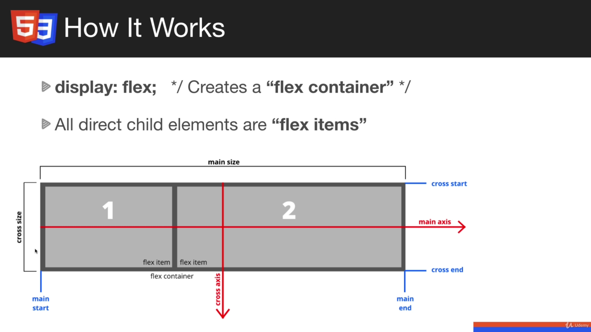

# Intro To Flexbox:

## What is Flexbox:
- Allows us to align things easily without using Float or framework(bootstrap's grid)
- Modern layout mode in CSS3
- 'flex' is a value for the display property
- Aligns items both horizontal(row) and vertical(column)
- Flex items can be re-ordered via CSS; without having to change the markup

### How it works:

- If we apply ```display:flex``` to a div element or any container, it creates a **flex container**
- Aligns horizontally in a row by default, we can specify ```flex-direction: column``` to align them vertically

## Flex Basics:
- ```Emmet Trick: .item{<h3>Item $</h3>}*3```
- o/p:
```html
<div class="item"><h3>Item 1</h3></div>
<div class="item"><h3>Item 2</h3></div>
<div class="item"><h3>Item 3</h3></div>
```

### Flex Item Sample:
```html
  <div id="container">
    <div class="item"><h3>Item 1</h3></div>
    <div class="item"><h3>Item 2</h3></div>
    <div class="item"><h3>Item 3</h3></div>
  </div>
```
- Here if we put flex display to container then item1-3 are flex item. Flex items are direct child of the element with display of flex.

### Flex-direction:
```css
  /* flex-direction: column; */
  flex-direction: row; /*default*/
  flex-direction: row-reverse; /* starts from right */
```

### flex : 1;
- Item cover whole width equally.
- if ```flex:1;``` is not set, item cover the portion of screen as occupied by the content. 
- We can use ```flex:2;``` to provide additional space to the item as:
```css
  .item:first-child{
    flex:2;
  }
```
- It seems like a ratio. 2:1

### Flex Wrap:
- We can only put 12 items with flex, more than that will create a scroll bar
- with ```flex-wrap: wrap;``` we can wrap the item like wraping text in text-editor. 
- Although not all item will have same width when they are on separate row

### flex-flow:
- Combination of flex-direction and flex-wrap
```css
  flex-direction: row; /*default*/
  flex-wrap: wrap;
  flex-flow: row wrap; /* combination of first two lines */
```

## Alignment and Order:

- ```flex-basis: 300px;``` gives the width of 300px

### Alignment Properties:
- THey go on the container
- justify-content: Align along the main axis(horizontal)
- align-items: Align items along the cross axis (Vertical)
- align-content: Align when extra space in cross axis

### justify-content (HORIZONTAL ALIGNMENT)
- ```justify: flex-start``` Aligns to the left, ```flex-end``` to the right, ```center``` to the center
- ```space-around``` distributes spaces equally so that whole content(flex item ) fit the viewport window
- ```space-between``` : No space in the edge
- ```space-evenly``` : equal space between item and edge and item and other items. 

### align-items (VERTICAL ALIGNMENT)
- First set the height for your container, **height** is MANDATORY
- ```align-items:stretch``` is the default. It stretches item all over the container's width. 
- ```flex-start``` : Stays at the topmost part of the container height. 
- ```flex-end``` : Go to the bottom
- ```center``` : In the center
- ```baseline``` : similar to flex-start

### align-content: 
- deals with aligning vertically where there is extra space. (Wraps the vertical space)
- ```align-content: flex-start;``` Options: **flex-end, center, space-around, space-between** 
- flex-start => top, -end => bottom

### aligning individual items:
- use align-self
- The property doesn't apply to block-level boxes, or to table cells. 
- If a flexbox item's cross-axis margin is auto, then align-self is ignored.
```css
  .item-2 {
    /* Align single item vertical */
    align-self: center;
    /* 
      Options:
      flex-start
      flex-end
      center 
      baseline
      stretch
      */
  }
```

### Order:
- Changing order without changing the markup.
```css
    .item-3{
      order: 1;
    }

    .item-1 {
      order: 2;
    }
```
- Although item-1 component appears before in markup item-3 component will be displayed first because it has lower order value