# CSS GRID

## What is CSS Grid ?

- Grid Layour system for CSS
- Similar to flexbox (More complex and powerful)
- Two-dimensional Layouts
- Can us "align-items", "justify-content", etc
- Partial support for IE11

### How it works?
- ```display:grid``` creates a grid
- all direct child elements are **"grid items"**
- **"grid-template-columns"** defines width and number of cols

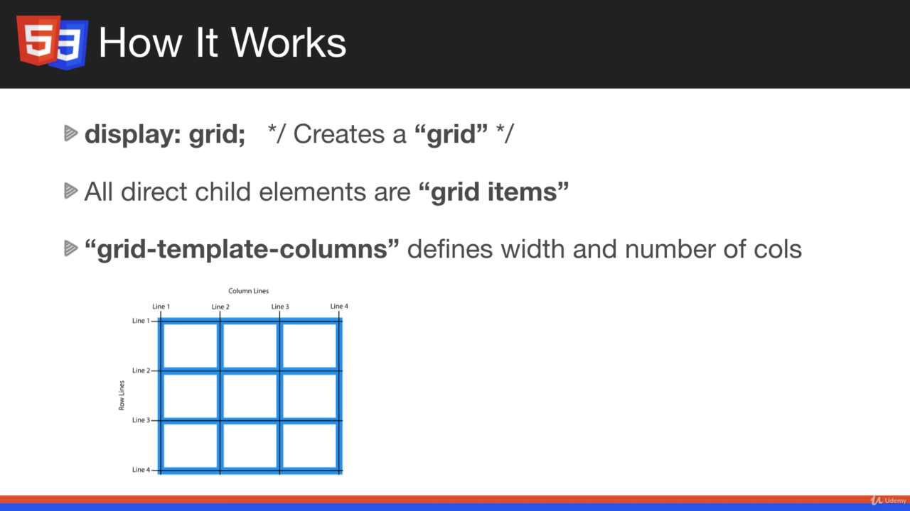

- ```fr``` unit of measure is going to be introduced, fr -> fractions.

### Two Dimensional Layouts
- Flex is not capable of 2-D layouts, it is used for single row or column

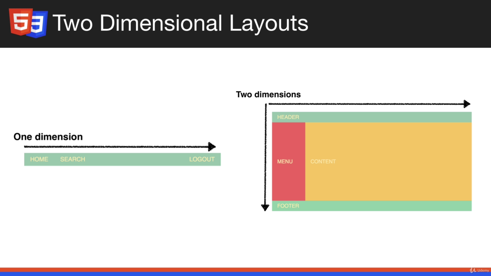

- Flex - Used for Navbar

### Spanning Rows and Columns with Grid:
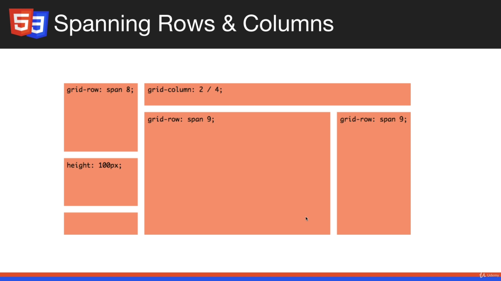

### Grid VS Flex:
- Use Grid for outer elements and grid-like layouts such as boxes.
- Use flex for simple alignment (Inner Elements, Menu Items, etc)
- Most of the stuff we have done so far, flex would be enough

## Grid Basics and Columns:

- Setting grid:

```css
  .grid{
    display: grid;

    /* 3 columns 200px wide */
    grid-template-columns: 200px 200px 200px;
  }
```
- Through grid template columns we specify the number of columns and the width of each column
- Here, If we have more than 3 grid items, it is going to continue on the next line with similar sequence of spots

### Setting width automatically:
```css
 grid-template-columns: 200px auto 200px;
```
- 2nd column's width is automatically adjusted

### Setting equal width automatically:
```css
 grid-template-columns: auto auto auto;
```
### For repeating pattern we have another option:

```css
  grid-template-columns: repeat(3, auto);
  /* three columns with  auto width is created */
```
- In the place of auto we can also specify width as 200px or something

### The ```fr``` unit:
- Fraction of the page
- Similar to flex property, flex:1, flex:2 and so on.
```css
      grid-template-columns: 1fr 2fr 1fr;
```
- this snippet gives width in the proportion of 1:2:1

#### fr with repeat
```css
grid-template-columns: repeat(3, 1fr);
```
- 3 colums of 1fr will be created

### Space between grid:
```css
  .grid{
    display: grid;
    grid-template-columns: repeat(3, 1fr);
    grid-gap: 1rem;
  }
```

### Practical Example:
- html:
```html
...
  <main>
    <!-- Main section/paragraph -->
    <section>
      <h3>Welcome to my site</h3>
      <p>Lorem ipsum dolor sit amet consectetur, adipisicing elit. Quo quis nam quae nihil exercitationem voluptates a minus quas enim temporibus eum nisi est fuga totam modi animi nobis, sequi atque.</p>
    </section>
    
    
    <!-- Side Bar -->
    <aside>
      <h3>Hello</h3>
      <p>Lorem ipsum, dolor sit amet consectetur adipisicing elit. Nemo consectetur voluptatum necessitatibus quod, quae porro.</p>
    </aside>
  </main>
...
```
- CSS
```css
  main{
    display: grid;
    grid-template-columns: 2fr 1fr;
    grid-gap: 1.5rem;
    }
```
- O/P:
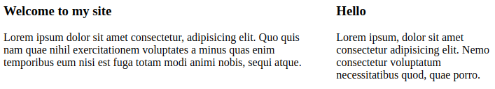

## Grid Rows:

- ```grid-template-rows``` property can be used
```css
  grid-template-rows: 1fr 2fr 3fr;
```
- When we have more than 3 three rows the remaining are called implicit rows and their sizes are going to be a default one

### Setting implicit rows's width with ```grid-auto-rows```
```css
  grid-auto-rows: 3fr;
```

### Using template rows and column together
```css
  .grid{
    display: grid;
    grid-template-columns: repeat(2, 1fr);
    grid-template-rows: 1fr 2fr 3fr;
    grid-auto-rows: 3fr;
  }
```
- O/P:
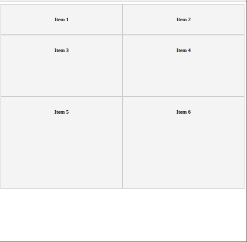

## Spanning Columns and Rows
- CSS:
```css
  .item:first-child {

    /* Specify the colum where this child will be placed */
    grid-column-start: 2; 

    /* Specify where the item will end */
    grid-column-end: 4;

    grid-row-start: 1;
    grid-row-end: 3;

  }
```
- O/P:
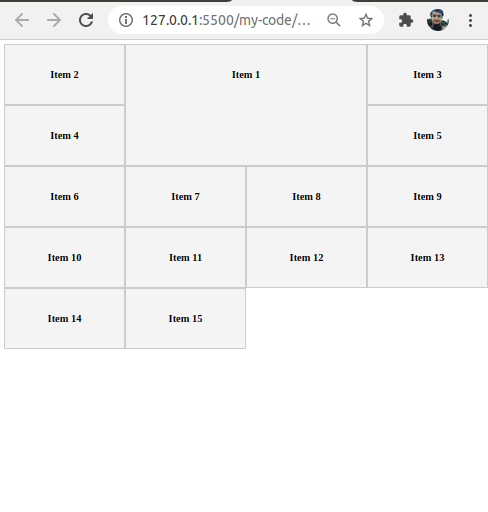

- Shorter Version:
```css
  .item:first-child {
    /* Shorter Version */
    grid-column: 1 / span 3;
grid-row: 1 / span 2;
  }
```
### nth child spanning:
```css
  .item:nth-child(9){
    grid-column: 2 / span 3;
    grid-row: 4 / span 2;
  }
```
<hr>

## Auto-Fit & Minmax:
- Can make grid responsive but not appropriate for all situation.
- Great for photo gallery, not used frequently in website layouts gives less control

```css
  .grid{
    display: grid;
    grid-template-columns: repeat(auto-fit, minmax(200px, 1fr));
  }
```

## Grid Template Areas:
- Allows us to map out the alignment of the element visually through the CSS
- we use the property ```grid-template-areas``` and list the component row by row
```css
    .container {
      display: grid;
      grid-template-areas: 
        'header header header'
        'content content sidebar'
        'box-1 box-2 box-2'
        'box-3 box-3 box-3'
        'footer footer footer' ;
      grid-gap: 1rem;
    }
```
- Desired O/P:
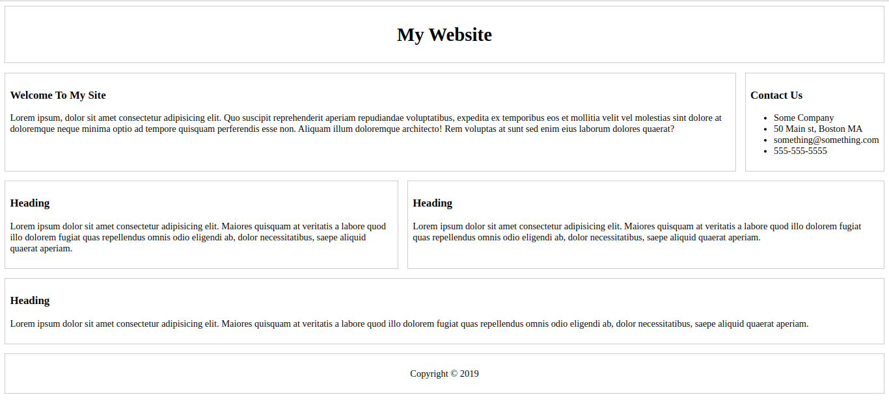

- Required HTML:
```html
  <body>
    <div class="container">
      <header class="header"><h1>My Website</h1></header>
      <section class="content">
        <h3>Welcome To My Site</h3>
        <p>
          Lorem ipsum, dolor sit amet consectetur adipisicing elit. Quo suscipit
          reprehenderit aperiam repudiandae voluptatibus, expedita ex temporibus
          eos et mollitia velit vel molestias sint dolore at doloremque neque
          minima optio ad tempore quisquam perferendis esse non. Aliquam illum
          doloremque architecto! Rem voluptas at sunt sed enim eius laborum
          dolores quaerat?
        </p>
      </section>
      <aside class="sidebar">
        <h3>Contact Us</h3>
        <ul>
          <li>Some Company</li>
          <li>50 Main st, Boston MA</li>
          <li>something@something.com</li>
          <li>555-555-5555</li>
        </ul>
      </aside>
      <div class="box-1">
        <h3>Heading</h3>
        <p>
          Lorem ipsum dolor sit amet consectetur adipisicing elit. Maiores
          quisquam at veritatis a labore quod illo dolorem fugiat quas
          repellendus omnis odio eligendi ab, dolor necessitatibus, saepe
          aliquid quaerat aperiam.
        </p>
      </div>
      <div class="box-2">
        <h3>Heading</h3>
        <p>
          Lorem ipsum dolor sit amet consectetur adipisicing elit. Maiores
          quisquam at veritatis a labore quod illo dolorem fugiat quas
          repellendus omnis odio eligendi ab, dolor necessitatibus, saepe
          aliquid quaerat aperiam.
        </p>
      </div>
      <div class="box-3">
        <h3>Heading</h3>
        <p>
          Lorem ipsum dolor sit amet consectetur adipisicing elit. Maiores
          quisquam at veritatis a labore quod illo dolorem fugiat quas
          repellendus omnis odio eligendi ab, dolor necessitatibus, saepe
          aliquid quaerat aperiam.
        </p>
      </div>
      <div class="box-4">
        <h3>Heading</h3>
        <p>
          Lorem ipsum dolor sit amet consectetur adipisicing elit. Maiores
          quisquam at veritatis a labore quod illo dolorem fugiat quas
          repellendus omnis odio eligendi ab, dolor necessitatibus, saepe
          aliquid quaerat aperiam.
        </p>
      </div>
      <footer class="footer"><p>Copyright &copy; 2019</p></footer>
    </div>
  </body>
```
- The next step on CSS (excluding border styling):
```css
  .header {
    grid-area: header;
    text-align: center;
  }
  .content{
    grid-area: content;
  }
  .sidebar{
    grid-area: sidebar;
  }
  .box-1{grid-area: box-1;}
  .box-2{grid-area: box-2;}
  .box-3{grid-area: box-3;}

  .footer {
    grid-area: footer;
    text-align: center;
  }
```
<hr>

## Media Queries and the Grid:
```css
  /* Widescreen */
  .grid{
    display: grid;
    grid-template-columns: repeat(4, 1fr);
    grid-gap: 1rem;
  }
```
- Output:
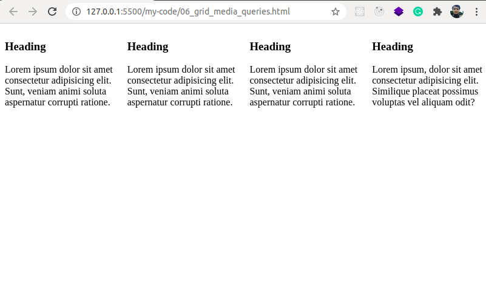

```css
  /* Tablet */
  @media(max-width: 768px){
    .grid{
      grid-template-columns: repeat(2, 1fr);
    }
  }
```
- Output:
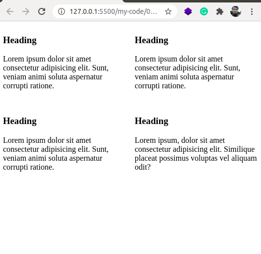

```css
  /* Smartphone */
  @media(max-width: 500px){
    .grid{
      grid-template-columns:  1fr;
    }
  }
```
- Ouput:
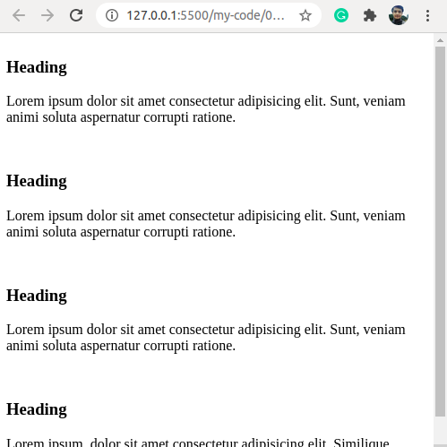

### Grid Template Area with Media Queries:
#### Before media query for smartphone:
```css
  .container {
    display: grid;
    grid-template-areas: 
      'header header header'
      'content content sidebar'
      'box-1 box-2 box-2'
      'box-3 box-3 box-3'
      'footer footer footer' ;
    grid-gap: 1rem;
  }
```
- Output:
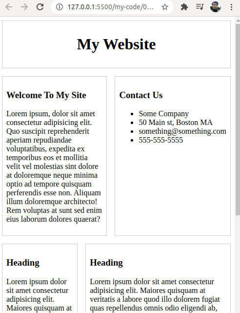

#### After implementing media query:
```css
  @media (max-width: 500px){
    .container {
      display: grid;
      grid-template-areas: 
        'header'
        'content'
        'sidebar'
        'box-1' 
        'box-2'
        'box-3' 
        'footer' ;
      grid-gap: 1rem;
    }
  }
```
- Output:
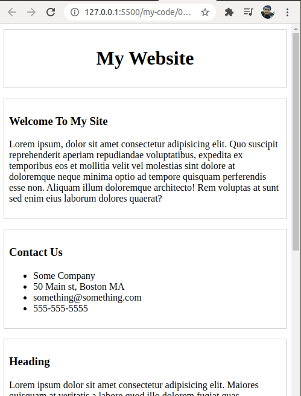