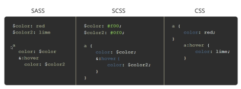

# Learning Sass:

## What is Sass?
- Syntactically Awesome Stylesheets
- CSS Preprocessor / Precompiler
- Enhances the functionality of CSS
- Other preprocessors include Less and Stylus
- Allows us to use CSS like a programming language (cut down repeated code, structure things in a more efficient way)

### How does Sass Work?
- Sass usess .scss(*preferred*) or .sass file extensions
- The browser does NOT read Sass, it must be compiled
- Sass files are compiled to normal CSS files
- There are many different types of Sass compilers (cli & gui)
- EG of Compiler: Node Sass(With NPM), Koala(GUI), VSCode Extensions

### What Does Sass Offer?
- *Variables, Conditionals, Nesting, Inheritance, Partials/Imports, Operators & Calculations, Functions & Mixins, Color Functions*
- Nesting helps organize like markup 
- Importing other CSS file is also possible

### .scss vs .sass
- .scss is usually preferred over .sass as it uses the same syntax as regular css
- .sass uses ident for scope definition



## Environment Setup With Node-Sass:
- Install node
- run ```npm init -y``` inside your sandbox folder to create a **package.json** file. 
- Install sass as : ```npm install node-sass```
- Create a script in **package.json**: 
```json
  "scripts": {
    "sass": "node-sass -w scss/ -o dist/css/ --recursive"
  },
```
- So, now we can run sass, watch scss folder and output to dist/css folder

- Running sass so it can constantly watch over the folder: ```npm run sass```
- terminal:

```
_Sass/my-code$ npm run sass

> my-code@1.0.0 sass /home/bomb/Documents/projects/html_css/modern_html_css/95_Learning_Sass/my-code
> node-sass -w scss/ -o dist/css/ --recursive
```

- Pressing ```ctrl+s``` has the following output in console:
```
=> changed: /home/bomb/Documents/projects/html_css/modern_html_css/95_Learning_Sass/my-code/scss/main.scss
Rendering Complete, saving .css file...
Wrote CSS to /home/bomb/Documents/projects/html_css/modern_html_css/95_Learning_Sass/my-code/dist/css/main.css
```
- the file ```main.css``` is created inside ```dist/css``` which is **css** equivalent to **scss**. We include this in our html.
- When you are ready to deploy you just take the dist folder

---

## Koala Sass Compiler 
---SKipped---

## VARIABLES AND PARTIALS

### Variables;
- Starts with **$** sign
```css
$color: blue;
$primary-color: steelblue;
$secondary-color: skyblue;
$light-color:#f4f4f4;
$dark-color: #333;
$font-stack : Arial, Helvetica, sans-serif;

body {
  background: $light-color;
  color: $dark-color;
  font-family: $font-stack;
  line-height: 1.5;
}
```

## Partials:
- You break your css a lot more in SASS. 
- In bootstrap, every elements such as button, links, paragraph have their own partial file. 
- In CSS you'd have to make an extra HTTP request everytime you try to access other files. 
- Sass makes it easy to import files. It builds files on top of each other

### Working with partials:
- Create a file ```_variables.scss``` inside scss folder
- File name starts with underscore, which imply the partial files and it won't be compiled.
- Here is the sandbox example: 
```css
/* _variables.scss */
$color: blue;
$primary-color: steelblue;
$secondary-color: skyblue;
$light-color:#f4f4f4;
$dark-color: #333;
$font-stack : Arial, Helvetica, sans-serif;
```
- We import the partials
```css
/* main.scss */
@import 'variables';

*{
  margin: 0;
  padding: 0;
}

body {
  background: $light-color;
  color: $dark-color;
  font-family: $font-stack;
  line-height: 1.5;
}
```
- The output in **main.css**:
```css
* {
  margin: 0;
  padding: 0; }

body {
  background: #f4f4f4;
  color: #333;
  font-family: Arial, Helvetica, sans-serif;
  line-height: 1.5; }
```
- When you create a new file, dont forget to restart sass

## Nesting and Structuring:
- We can structure sass similar to html:
- Here's is the html snippet
```html
  <header>
    <h1>Sass Sandbox</h1>
  </header>
```
- To style h1 that is inside header we can do the nesting:
```scss
header {
  background: $dark-color;
  color: $light-color;
  padding: 1rem;

  h1 {
    text-align: center;
  }
}
```
### Getting a little creative:
- here **&-a** implies **.section-a** & brings the parent's name by looking at the scope it is currently in.
```scss
.section {
  padding: 3rem;

  h3 {
    font-size: 2rem;
  }

  &-a {
    background: $primary-color;
    color: #fff;
  }
  &-b {
    background: $secondary-color;
    color: #fff;
  }
}
```
- **html:**
```html
  <section class="section-a">
    <h3>Section A</h3>
    <p>Lorem ipsum dolor sit amet consectetur adipisicing elit. Alias illum dolores quaerat voluptates dolor harum fugit nostrum perferendis, quae eligendi error repellat non doloribus obcaecati quam tempore similique, ea cupiditate.</p>
    <a href="#" class="btn-light">READ MORE</a>
  </section>
  <section class="section-b">
    <h3>Section B</h3>
    <p>Lorem ipsum dolor sit amet consectetur adipisicing elit. Alias illum dolores quaerat voluptates dolor harum fugit nostrum perferendis, quae eligendi error repellat non doloribus obcaecati quam tempore similique, ea cupiditate.</p>
    <a href="#" class="btn-dark">READ MORE</a>
  </section>
```

## Inheritance and Contrast:
- Set of style that can be extended by declaring with %
- Sandbox:
```css
%btn-shared {
  display: inline-block;
  padding: 0.7rem 2 rem;
  border: none;
  cursor: pointer;
  text-decoration: none;
  margin-top: 1rem;
}

.btn {
  &-light {
    @extend %btn-shared;
    background-color: $light-color;
    color: #333;
  }
  &-dark {
    @extend %btn-shared;
    background-color: $dark-color;
    color: #fff;
  }
}
```

## Functions, Mixins & More:
- Function Returns Something
- Mixin is just a set of styles you want to include
- Defining Functions:
```css
// Set text Color
@function set-text-color($bgcolor) {
  @if(lightness($bgcolor) > 50) {
    @return #000;
  } @else {
    @return #fff;
  }
}
```
- **Note the extensive use of @ , it is ```@function, @if, @else, @return, @import```** 
- Importing and using the partials with functions:
```css
@import '_functions';

header {
  background: $dark-color;
  color: set-text-color($dark-color);
  padding: 1rem;
}
```

### Using mixins:
- define:
```scss
//"_functions.scss"

// Tansform Mixin:
@mixin transform ($property) {
  // These are the prefixes ////
  --webkt-transform: $property;
  -ms-transform: $property;
  /////////////////////////////

  transform: $property;
}
```
- Import and use
```scss
// main.scss

@import '_functions';

...

.btn {
  &-light {
    @extend %btn-shared;
    background-color: $light-color;
    color:set-text-color($light-color);

    &:hover{
      @include transform(rotate(20deg));
    }
  }

  &-dark {
    @extend %btn-shared;
    background-color: $dark-color;
    color: set-text-color($dark-color);

    &:hover{
      @include transform(rotate(-20deg));
    }
  }
}
```

### Inbuilt Functions:
- Darken the color with ```darken()```:

```background-color : darken($light-color, 10%);```

- lighten the dark with ```lighten()```:

```background-color : lighten($dark-color, 10%);```