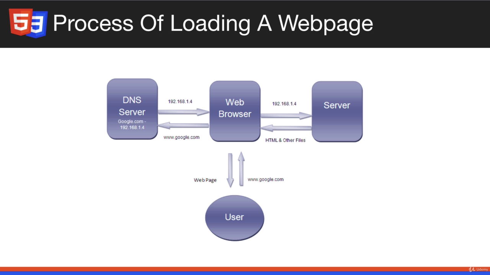

# MODERN HTML AND CSS FROM THE BEGINNING (INCLUDING SASS)

### CONTENT:

- HTML, CSS, UI
- Responsive Design
- CSS flexbox
- CSS grid
- Animation (Transitions, Keyframes, etc)
- Variables, Transform, Pseudo Selectors, etc
- Sticky Menus, Overlays, Form Styling, Landing Pages, etc
- Sass CSS Pre-compiler
- Deployment - Shared Host & Netlify

### More about the course:

- Bootstrap independent
- Section 1-4 (beginners level)

### How the web works:

#### The Internet:

- Global network of computers
- Each computer/router has a IP address
- Computer talk to eachother using the TCP/IP protocol
- HTTP handles web traffic(requests/responses)

#### Web Servers:

- Websites/Webpages are files stored on computers that run a piece of software called a web server (Apache, Nginx, etc)
- Hosting Companies provide space on a serer for your website
- Domain names can be purchased from registrars and linked to your hosting account/web server
- DNS is used to map IP addresses to domain names
  

### The Roles of HTML and CSS in Web Development

- Building blocks of Website

#### HTML:

- Hypertext Markup Language (not a programming language)
- Markup for creating webpages/document. Purely visual, creating content with text, links, images and so on and so programming features such as conditional, loops, variables and so on.

#### CSS:

- Cascading Style Sheets, styling/stylesheet language
- Not a programming language, used for styling HTML elements
- Has Variables, You can do Calculation, you can extend with SASS/LESS

#### POWER OF HTML AND CSS:

- Build static websites: Portfolios, small business sites, informational and brochure websites, etc
- Build the visual part of anything: Stores, social networks, etc

## New Topics:
- Container queries [Youtube Link](https://www.youtube.com/watch?v=jUQ2-C5ZNRc)